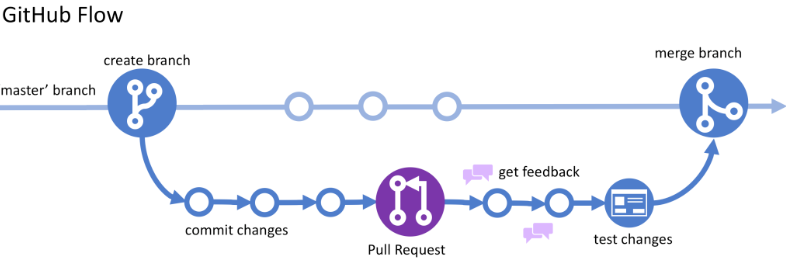

# Git Guide 
## Prerequisite
1. At the heart of GitHub is an open source version control system (VCS) called Git. Git is responsible for everything GitHub-related that happens locally on your computer. 
   1. [Download and install the latest version of GIT](https://git-scm.com/downloads)
   2. [Set your username in GIT](https://docs.github.com/en/get-started/getting-started-with-git/setting-your-username-in-git)
   3. [Set your commit email address in Git](https://docs.github.com/en/account-and-profile/setting-up-and-managing-your-personal-account-on-github/managing-email-preferences/setting-your-commit-email-address)
   4. [Authenticating with GitHub from Git](https://docs.github.com/en/get-started/quickstart/set-up-git#authenticating-with-github-from-git)
   5. [Add SSH keys in GITHUB](https://docs.github.com/en/authentication/connecting-to-github-with-ssh/about-ssh)
2. It good to have some git desktop client to work fast. it is optional and totally depends upon the individual. Some recommendation are list down
   1. [Github Desktop](https://desktop.github.com/) 
   2. [Source Tree](https://www.sourcetreeapp.com/)
   3. [Tortoise Git](https://tortoisegit.org/)
## GitHub Flow Overview 
   1. clone repository from GitHub 
   2. create a working branch on local computer
   3. Implement the requested feature, make sure all tests are passing, and commit all changes in the new branch
   4. checkout the main branch locally 
   5. Merge main branch into your local branch    
   6. Resolve merge conflicts if occurs
   7. push/upload the changes to remote branch
   8. Create Pull request
   9. Add other as reviewers
   10. Merge branch into main if everyone approve the changes 
   11. 

## Best practices
    1. Don’t git push straight to main. Make your own branch and work 
    2. Don’t commit code as an unrecognized author. Configure your email, username properly
    3. Add other team memebers for faster code reviews
    4. Don’t add secrets into source code
    5. Don’t commit dependencies into source control
    6. Don’t commit local config files into source control 
    7. Archive dead repositories/branches. if no repo or bracnh is more beneficial, archive it properly
    8. Use a branch naming convention
    9. Keep branches up to date with main
    10. keep pushing your code to your own branches on daily base
    11. Remove merge conflicts as soon as possible 

## [GIT CHEAT SHEET](https://education.github.com/git-cheat-sheet-education.pdf) 

